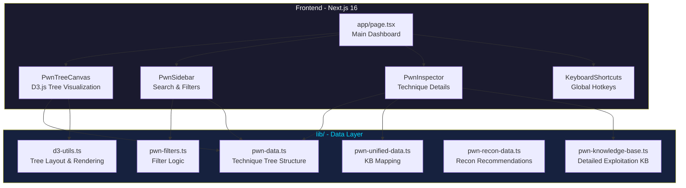
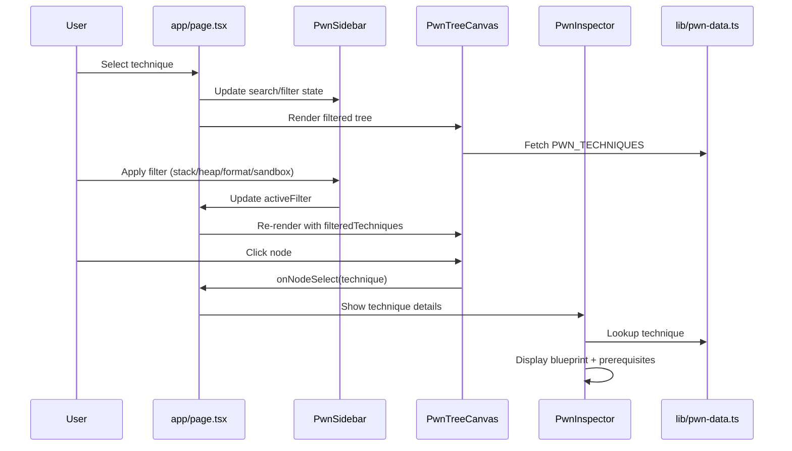
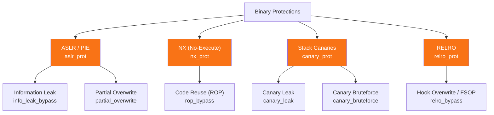
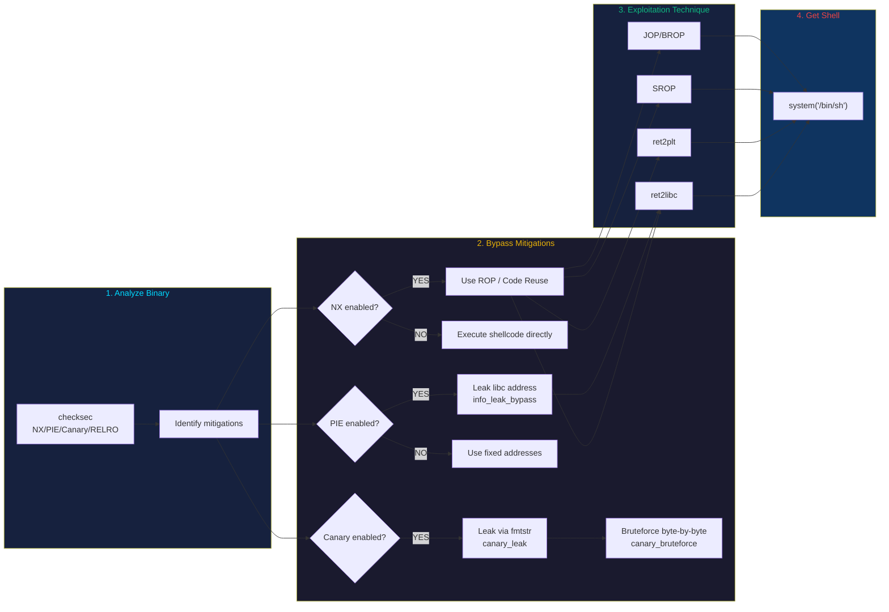
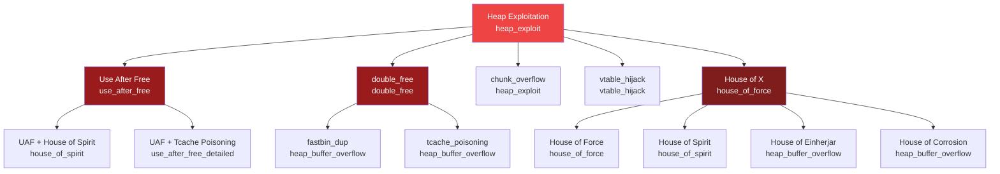
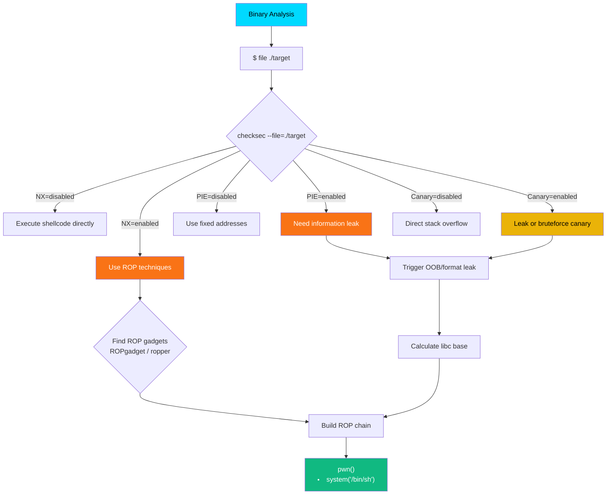
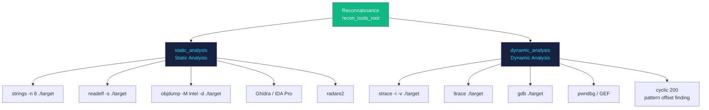

# PWN Exploitation Decision Tree - Interactive Dashboard

A comprehensive, interactive cyberpunk-themed decision tree for binary exploitation techniques and vulnerability analysis. Built with React, D3.js, Next.js, and Tailwind CSS.

**Knowledge Base by**: [Aryma-f4/pwn-framework](https://github.com/Aryma-f4/pwn-framework)  
**Data Source**: Master Binary Exploitation Decision & Knowledge Matrix v5.0

## Architecture Overview



## Data Flow



## Exploitation Tree Structure

```mermaid
flowchart TB
    ROOT["PWN Journey<br/>root"]
    
    ROOT --> SETUP["Setup & Prerequisites<br/>setup_tools_root"]
    ROOT --> PREREQ["Prerequisites<br/>prerequisites_root"]
    ROOT --> TOOLS["Core Tools<br/>tools_root"]
    ROOT --> EXPLOIT["Exploitation Tree<br/>exploitation_root"]
    ROOT --> MITIG["Binary Protections<br/>mitigations_root"]
    ROOT --> RECON["Reconnaissance<br/>recon_tools_root"]

    EXPLOIT --> BO["Buffer Overflow<br/>buffer_overflow"]
    EXPLOIT --> FS["Format String<br/>format_string"]
    EXPLOIT --> HEAP["Heap Exploit<br/>heap_exploit"]
    EXPLOIT --> SANDBOX["Sandbox Escape<br/>sandbox_escape"]
    EXPLOIT --> FSOP["FSOP Exploit<br/>fsop_exploit"]
    EXPLOIT --> INT["Integer Exploits<br/>integer_exploits"]

    BO --> STACK_PIVOT["Stack Pivot<br/>stack_pivot"]
    BO --> ROP["ROP Chain<br/>rop_chain"]
    BO --> RET2CSU["ret2csu<br/>ret2csu"]
    BO --> RET2DLRESOLVE["ret2dlresolve<br/>ret2dlresolve"]
    BO --> SROP["SROP<br/>srop"]
    BO --> STACK_CLASH["Stack Clash<br/>stack_clash"]
    BO --> BROP["BROP<br/>brop"]
    BO --> JOP["JOP<br/>jop"]
    BO --> RET2VDSO["ret2vdso<br/>ret2vdso"]

    ROP --> ROP_EXEC["rop_exec<br/>leaf"]

    FS --> FORMAT_LEAK["format_leak<br/>format_leak"]
    FS --> FORMAT_WRITE["format_write<br/>format_write"]
    FS --> GOT_OVERWRITE["got_overwrite<br/>got_overwrite"]

    HEAP --> UAF["Use After Free<br/>use_after_free"]
    HEAP --> DOUBLE_FREE["double_free<br/>double_free"]
    HEAP --> VTABLE["vtable Hijack<br/>vtable_hijack"]
    HEAP --> HEAP_CONTROL["heap_control<br/>heap_control"]
    HEAP --> HEAP_SPRAY["heap_spray<br/>heap_spray"]
    HEAP --> HOF["House of Force<br/>house_of_force"]
    HEAP --> HOS["House of Spirit<br/>house_of_spirit"]

    style ROOT fill:#00d9ff,color:#000
    style EXPLOIT fill:#a78bfa,color:#fff
    style BO fill:#10b981,color:#fff
    style FS fill:#f97316,color:#fff
    style HEAP fill:#ef4444,color:#fff
    style SANDBOX fill:#eab308,color:#000
```



## Mitigation Bypass Tree



## Exploitation Decision Flow (Bypass Path)



## Heap Exploitation Family



## Reconnaissance Workflow



## Reconnaissance Tools



## Component Hierarchy

```mermaid
flowchart TB
    APP["app/page.tsx<br/>PwnExploitationDashboard"]
    
    APP --> HEADER["pwn-header<br/>Logo + Actions"]
    APP --> SIDEBAR["PwnSidebar<br/>Search/Filters/Phases"]
    APP --> CANVAS["PwnTreeCanvas<br/>D3.js Tree"]
    APP --> INSPECTOR["PwnInspector<br/>Details Panel"]
    APP --> FOOTER["pwn-footer<br/>Attribution"]

    SIDEBAR --> SEARCH["SearchInput<br/>Real-time search"]
    SIDEBAR --> FILTERS["Vulnerability Filters<br/>stack/format/heap/sandbox"]
    SIDEBAR --> PHASES["Phase Tracking<br/>recon/bypass/exploit/execute"]
    SIDEBAR --> PINNED["Pinned Techniques<br/>Ctrl+P"]

    INSPECTOR --> DETAILS["TechniqueDetails<br/>blueprint/prerequisites"]
    INSPECTOR --> PRECONDITIONS["Preconditions<br/>stack/format/heap/sandbox tags"]
    INSPECTOR --> EXPLOIT_PATHS["Exploitation Paths<br/>multiple strategies"]
    INSPECTOR --> CHECKLIST["Operator Checklist<br/>step-by-step"]
    INSPECTOR --> REFERENCES["References<br/>tools + writeups"]

    CANVAS --> ZOOM["ZoomControls<br/>+/reset/-"]
    CANVAS --> NODES["TreeNodes<br/>colored by category"]
    CANVAS --> LINKS["Cubic Bezier Links<br/>animated"]

    style APP fill:#1a1a2e,color:#fff
    style SIDEBAR fill:#16213e,color:#00d9ff
    style CANVAS fill:#16213e,color:#10b981
    style INSPECTOR fill:#16213e,color:#a78bfa
```



## Features

### Interactive Visualization
- **D3.js Hierarchical Tree**: Real-time interactive tree layout with zoom/pan controls
- **Color-Coded Nodes**: Visual categorization by vulnerability type:
  - 🟦 Cyan: `root` - Entry points
  - 🟩 Lime: `recon` - Reconnaissance techniques
  - 🟪 Purple: `technique` - Intermediate techniques
  - 🟧 Orange: `mitigation` - Mitigation bypasses
  - 🟥 Red: `leaf` - Terminal exploitation techniques
- **Smooth Animations**: Cubic bezier link paths with transition effects
- **Node Selection**: Click any node to inspect detailed information

### Search & Discovery
- **Real-Time Search**: Find techniques by name with instant highlighting
- **Path Highlighting**: Visualize parent-child relationships for matched nodes
- **Quick Filters**: Pre-built filters for vulnerability types:
  - **Stack-based**: Buffer overflows and ROP exploits
  - **Format Strings**: Printf vulnerabilities and format string attacks
  - **Heap-based**: Heap corruption and UAF exploits
  - **Sandbox Escape**: Container and browser breakouts

### Comprehensive Knowledge Base
Each technique includes:

#### **Preconditions**
- Detailed summary of vulnerability requirements
- List of necessary conditions for exploitation
- Step-by-step detection and analysis procedures
- Offset discovery methods (pwntools, pwndbg, GEF, PEDA)

#### **Exploitation Paths**
Multiple exploitation strategies with:
- Detailed step-by-step instructions
- Required tools and utilities
- Code snippets with copy-to-clipboard functionality
- Applicable libc versions and environment requirements

#### **Operator Checklist**
Complete workflow checklist for:
- Protection analysis
- Vulnerability detection
- Gadget hunting and chain building
- Local and remote testing

#### **References**
- Tool documentation links
- External write-ups and tutorials
- GitHub repositories
- CTF challenge references

### Keyboard Shortcuts

| Key | Action |
|-----|--------|
| `/` | Focus search input |
| `Esc` | Clear selection / close mobile overlay |
| `?` | Show keyboard help modal |
| `Ctrl+P` | Pin/unpin selected technique |

## Technical Stack

- **Framework**: Next.js 16 (App Router)
- **Visualization**: D3.js (pure, no reactwrapper)
- **Styling**: Tailwind CSS v4 + Custom Cyberpunk CSS
- **Language**: TypeScript
- **Icons**: Lucide React
- **Components**: shadcn/ui

## Covered Exploitation Techniques

### Stack-Based Buffer Overflow (SBOF)
- **Paths**: ret2shellcode, ret2libc, ret2plt, ret2syscall/SROP
- **Tools**: ROPgadget, pwntools, one_gadget, libc-database
- **Protections**: Canary bypass, ASLR defeat, NX mitigation

### Format String Vulnerability (FSB)
- **Paths**: Arbitrary read, arbitrary write, canary leak + SBOF
- **Techniques**: %n/%hn/%hhn writes, stack leaking, GOT hijacking
- **Tools**: pwntools fmtstr_payload, manual crafting

### Heap Buffer Overflow
- **Paths**: fastbin dup, tcache poisoning, House of Force, unsorted bin attack
- **Techniques**: Chunk corruption, allocator manipulation, arbitrary write
- **Tools**: pwndbg heap commands, how2heap reference

### Sandbox / Seccomp Escape
- **Paths**: ORW (open/read/write) chain, seccomp filter bypass
- **Techniques**: Syscall gadget chaining, BPF filter analysis
- **Tools**: seccomp-tools, ROPgadget, ltrace/strace

## Core Tools Reference

Integrated knowledge base includes complete documentation for:
- **Binary Analysis**: checksec, readelf, objdump, file, nm
- **Debugging**: pwndbg, GEF, PEDA, GDB
- **ROP Gadgets**: ROPgadget, ropper, one_gadget
- **Exploitation**: pwntools, msfvenom
- **Dynamic Analysis**: strace, ltrace, radare2
- **Libc Lookup**: libc.rip, libc-database
- **Sandbox**: seccomp-tools

## Data Structure

### pwn-data.ts
Original technique tree structure with vulnerability type tagging

### pwn-knowledge-base.ts
Comprehensive knowledge base with:
- 4 major exploitation classes
- Preconditions and detection steps
- Multiple exploitation paths per technique
- Operator checklists
- Tool references

### pwn-unified-data.ts
Mapping layer connecting tree nodes with knowledge base entries

### d3-utils.ts
D3 visualization utilities:
- Hierarchy building with filtered techniques
- Tree layout calculations
- Color/opacity management by category
- Link path generation
- Node highlighting logic

## Keyboard Shortcuts & Interactions

- **Click Node**: Select and inspect technique details
- **Zoom**: Mouse wheel within canvas
- **Pan**: Drag canvas with mouse
- **Double-Click**: Reset zoom to full tree
- **Search**: Type to filter and highlight matching nodes
- **Filters**: Click preset filters to show vulnerability-type subsets

## Installation

### Prerequisites
- Node.js 18+ with pnpm

### Setup
```bash
# Install dependencies
pnpm install

# Run development server
pnpm dev

# Open browser to http://localhost:3000
```

### Deploy
```bash
# Deploy to Vercel (recommended)
vercel

# Or build for production
pnpm build
pnpm start
```

## API Routes & Data Flow

All data is client-side rendered. No backend required.

**Data Files**:
- `/lib/pwn-data.ts` - Tree structure
- `/lib/pwn-knowledge-base.ts` - KB entries
- `/lib/pwn-unified-data.ts` - Node-to-KB mapping
- `/lib/pwn-filters.ts` - Filter logic
- `/lib/d3-utils.ts` - Visualization helpers

## Styling

### Design System
- **Colors**: Cyberpunk dark palette (zinc-950, slate-900, slate-800)
- **Accents**: Cyan, Emerald, Amber, Rose (by category)
- **Glows**: Neon drop-shadows for depth
- **Fonts**: System fonts optimized for readability

### CSS Files
- `/styles/pwn-dashboard.css` - Main styles with neon effects
- `/app/globals.css` - Tailwind base configuration

## Contributing

This dashboard integrates the Master Binary Exploitation Decision Matrix from the **pwn-framework** project.

To contribute enhancements, exploits, or techniques:
- Fork: [github.com/Aryma-f4/pwn-framework](https://github.com/Aryma-f4/pwn-framework)
- Add techniques to the knowledge base
- Submit pull request with test cases
- Update reference links and write-ups

## Knowledge Base References

Each technique includes links to:
- **CTF101**: [ctf101.org/binary-exploitation](https://ctf101.org/binary-exploitation/)
- **how2heap**: [github.com/shellphish/how2heap](https://github.com/shellphish/how2heap)
- **pwntools Docs**: [docs.pwntools.com](https://docs.pwntools.com)
- **pwndbg**: [github.com/pwndbg/pwndbg](https://github.com/pwndbg/pwndbg)
- **seccomp-tools**: [github.com/david942j/seccomp-tools](https://github.com/david942j/seccomp-tools)
- **libc.rip**: Online libc symbol resolver
- **one_gadget**: [github.com/david942j/one_gadget](https://github.com/david942j/one_gadget)

## License

Knowledge base data sourced from public CTF resources and security research.  
Code licensed under MIT.

## Acknowledgments

- **Data Source**: Master Binary Exploitation Decision & Knowledge Matrix v5.0
- **Framework**: [Aryma-f4/pwn-framework](https://github.com/Aryma-f4/pwn-framework)
- **Inspiration**: CTF101, how2heap, pwntools documentation
- **Tools Referenced**: pwndbg, ROPgadget, seccomp-tools, and the broader security community